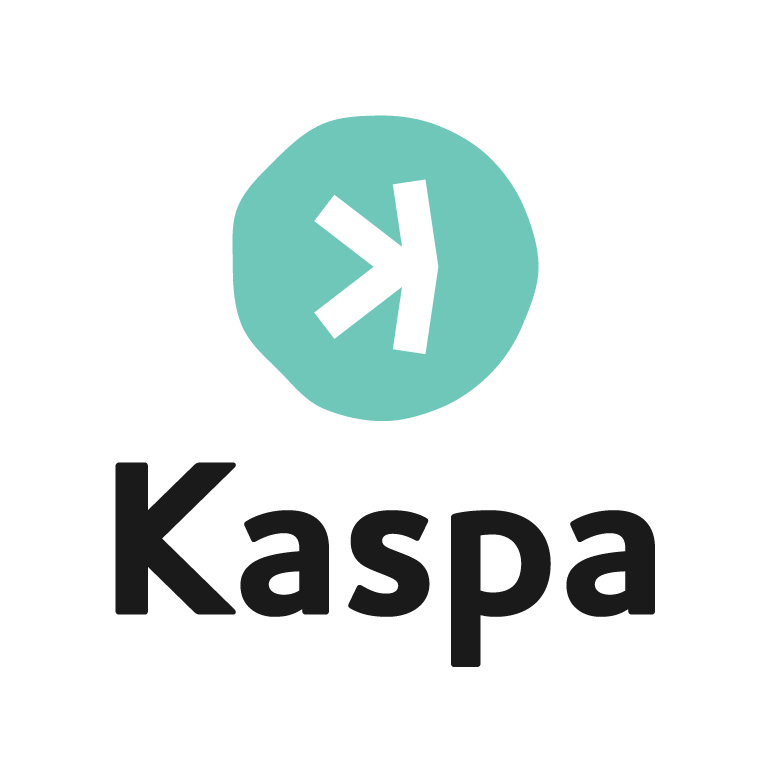

# 🪙 Kaspa Node for Unraid (Rust Implementation)

<p align="center">
  
</p>

This repository provides an **Unraid Docker template** for running the official **Kaspa Rust Node** (`kaspanet/rusty-kaspad`) natively on Unraid.  
It was built because **no official Unraid App or template** existed — and most online guides cover only Linux or Windows setups.
This template makes it easy to deploy a fully functional, persistent Kaspa node on Unraid with one click.

---

## 🚀 Features

- Based on **official Rust implementation**: [`kaspanet/rusty-kaspad`](https://github.com/kaspanet/rusty-kaspa)
- Compatible with **Unraid 6.12+**
- **Persistent data** under `/mnt/user/appdata/kaspa`
- **Optimized Docker run parameters** for stable P2P and RPC communication
- **Auto-restart** and clean lifecycle handling on Unraid
- Ready for integration with wallets and mining setups

---

## 🧰 Requirements

| Component | Minimum |
|------------|----------|
| Unraid | 6.12 or newer |
| RAM | 4 GB |
| Storage | 50+ GB free (blockchain data) |
| Network | Ports 16110, 16111, 17110 open |

---

## ⚙️ Quick Start (Manual Deployment)

If you want to run the container manually before adding the Unraid template:

```bash
mkdir -p /mnt/user/appdata/kaspa

docker run -d \
  --name kaspa-node \
  --restart unless-stopped \
  -p 16111:16111 \
  -p 16110:16110 \
  -p 17110:17110 \
  -v /mnt/user/appdata/kaspa:/app/data \
  kaspanet/rusty-kaspad:latest \
  kaspad \
  --utxoindex \
  --disable-upnp \
  --maxinpeers=64 \
  --outpeers=32 \
  --yes
```

---

## 📦 Installation via Unraid Template

1. Open Unraid Web UI → **Docker** tab
2. Click **Add Container**
3. At the bottom of the form, find **Template repositories**
4. Add this repository URL:
   ```
   https://github.com/rays23/unraid-kaspa-node
   ```
5. Select **Kaspa Node** from the template list
6. Click **Apply** to install

The container will automatically pull the latest `kaspanet/rusty-kaspad` image and start syncing the blockchain.

---

## 🔧 Configuration

### Ports

| Port | Protocol | Description |
|------|----------|-------------|
| 16110 | TCP | P2P communication |
| 16111 | TCP | RPC endpoint |
| 17110 | TCP | JSON-RPC endpoint |

### Data Directory

All blockchain data is stored in:
```
/mnt/user/appdata/kaspa
```

You can change this path in the Unraid Docker template if needed.

### Extra Parameters

The template includes these optimized flags by default:

```bash
--utxoindex         # Enable UTXO index for better performance
--disable-upnp      # Disable UPnP (recommended for Unraid)
--maxinpeers=64     # Max incoming peers
--outpeers=32       # Max outgoing peers
--yes               # Auto-confirm prompts
```

---

## 🛠️ Troubleshooting

### Container won't start
- Check Docker logs: `docker logs kaspa-node`
- Ensure ports are not in use by another container
- Verify sufficient disk space

### Slow sync speed
- This is normal for the initial blockchain download
- Current blockchain size: ~40GB (and growing)
- Full sync can take 24-48 hours depending on hardware and network

### Wallet connection issues
- Confirm RPC ports (16111, 17110) are open
- Use `localhost:16111` or your Unraid IP when connecting from LAN
- For external access, configure port forwarding on your router

---

## 📚 Resources

- [Official Kaspa Rust Node Repository](https://github.com/kaspanet/rusty-kaspa)
- [Kaspa Discord](https://discord.gg/kaspa)
- [Kaspa Website](https://kaspa.org)

---

## 🤝 Contributing

Found a bug or have a suggestion? Feel free to open an issue or submit a pull request!

---

## 📄 License

This template is provided as-is under the MIT License. The Kaspa Rust Node itself is licensed separately by the Kaspa Network.

---

**Happy mining! ⛏️💎**
